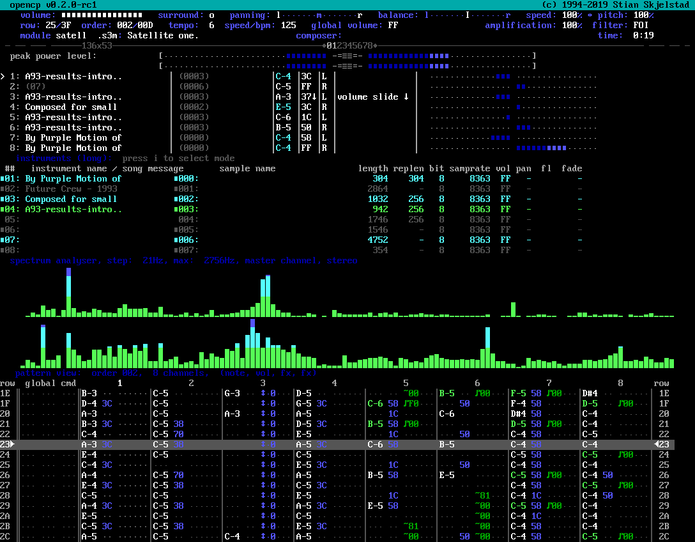

# What is it?

UNIX port of Open Cubic Player, which is a text-based player with some few graphical views. Visual output can be done through nCurses, Linux console (VCSA + FrameBuffer), X11 or SDL/SDL2. It can be compiled on various different unix based operating systems.

# What can it play?

Amiga style [modules](https://en.wikipedia.org/wiki/Module_file) files with more: <!-- http://fileformats.archiveteam.org/wiki/Amiga_Module -->
- \*.AMS, [Velvet Studio](http://www.pouet.net/prod.php?which=64890) and [Extreme's Tracker](https://www.pouet.net/prod.php?which=88711)
- \*.DMF, [X-Tracker](http://www.pouet.net/prod.php?which=55233)
- \*.IT, [Impulse Tracker](https://en.wikipedia.org/wiki/Impulse_Tracker) or use the modern [Schism Tracker](http://schismtracker.org/)
- \*.MDL, [DigiTrakker](http://www.pouet.net/prod.php?which=13371), now developed as [MilkyTracker](https://en.wikipedia.org/wiki/MilkyTracker)
- \*.MOD, [ProTracker](https://en.wikipedia.org/wiki/ProTracker) or use the modern [ProTracker Clone](https://github.com/8bitbubsy/pt2-clone)
- \*.MTM, [MultiTracker Module Editor](http://www.pouet.net/prod.php?which=13362)<!-- - \*.MXM, mxmplayer - mini GUS player, intermediate file format to support .XM and similiar files -->
- \*.NST, [NoiseTracker](https://en.wikipedia.org/wiki/NoiseTracker)
- \*.OKT, [Oktalyzer](http://www.robotplanet.dk/amiga/oktalyzer/)<!-- https://www.wikidata.org/wiki/Q21041560 -->
- \*.PTM, [PolyTracker](http://justsolve.archiveteam.org/wiki/Poly_Tracker_module)
- \*.STM, [Scream Tracker 2](https://en.wikipedia.org/wiki/Scream_Tracker)
- \*.S3M, [Scream Tracker 3](https://en.wikipedia.org/wiki/Scream_Tracker)
- \*.ULT, [Ultra Tracker](http://www.pouet.net/prod.php?which=63386)
- \*.WOW, Grave Composer <!-- http://fileformats.archiveteam.org/wiki/Grave_Composer_module -->
- \*.XM, [FastTracker 2](https://en.wikipedia.org/wiki/FastTracker_2) or use the modern [FastTracker 2 Clone](https://github.com/8bitbubsy/ft2-clone)
- \*.669, [Composer 669](http://www.pouet.net/prod.php?which=63357) <!-- https://www.wikidata.org/wiki/Q9135198 -->

Code from [STYMulator](http://atariarea.krap.pl/stymulator/) to play music from [Atari ST](https://en.wikipedia.org/wiki/Atari_ST#Technical_specifications) \([Yamaha YM2149](https://en.wikipedia.org/wiki/General_Instrument_AY-3-8910)\):
- \*.YM

Fork of [libsidplayfp](https://sourceforge.net/p/sidplay-residfp/wiki/Home/) to play music from [C64](https://en.wikipedia.org/wiki/Commodore_64) \([SID 6581/8580](https://en.wikipedia.org/wiki/MOS_Technology_6581)\):
- \*.SID
- \*.RSID

Code from [aylet](http://www.svgalib.org/rus/aylet.html) to play music from [ZX Spectrum](https://en.wikipedia.org/wiki/ZX_Spectrum)/[Amstrad CPC](https://en.wikipedia.org/wiki/Amstrad_CPC) \([Yamaha YM2149](https://en.wikipedia.org/wiki/General_Instrument_AY-3-8910)\):
- \*.AY

Audio Files (both compressed and PCM styled):
- \*.WAV
- \*.OGG
- \*.FLAC
- \*.MP2
- \*.MP3

Audio CDs: Linux support only, using digital read out API
- \*.CDA

Fork of [TiMidity++](http://timidity.sourceforge.net/) is used to play [MIDI](https://en.wikipedia.org/wiki/MIDI#General_MIDI):
- \*.MID

[AdPlug](http://adplug.github.io/) can read a wide range of music formats designed for the [OPL2](https://en.wikipedia.org/wiki/Yamaha_YM3812)/[OPL3](https://en.wikipedia.org/wiki/Yamaha_YMF262) Adlib sound chip. Examples:
- \*.HSC
- \*.SNG
- \*.D00
- \*.ADL
- \*.VGM
- \*.RAD [Reality Adlib Tracker](https://www.3eality.com/productions/reality-adlib-tracker)

[HivelyTracker](http://www.hivelytracker.co.uk/) tracked music, using code from the original tracker repository:
- \*.HVL [Hively Tracker](https://github.com/pete-gordon/hivelytracker)
- \*.AHX [AHX](http://amigascne.org/abyss/ahx/) or use the not yet existant modern [AHX Clone](https://github.com/8bitbubsy/ahx-clone)

# Manual Page

https://manpages.debian.org/testing/opencubicplayer/ocp.1.en.html

# Usage

<kbd>esc</kbd><kbd>esc</kbd>: exit the program

<kbd>alt</kbd> + <kbd>k</kbd>: List the available keyshort-cuts in the current view

## While playing

Note: if letters are capital, press them with <kbd>shift</kbd>

<kbd>Enter</kbd>: next file from the playlist, if playlist is empty it opens the file-browser

<kbd>f</kbd>: File-browser

<kbd>a</kbd>: Text FFT analyzer, <kbd>A</kbd>: toggle FFT analyzer, <kbd>tab</kbd>, toggle colors

<kbd>c</kbd>: Text Channel viewer

<kbd>t</kbd>: Text Track viewer

<kbd>g</kbd>: Lo-Res FFT analyzer + history
<kbd>G</kbd>: High-Res FFT analyzer + history

<kbd>b</kbd>: Phase viewer

<kbd>o</kbd>: Oscilloscope

<kbd>v</kbd>: Peak power level

<kbd>m</kbd>: Volume control

<kbd>x</kbd> / <kbd>alt</kbd> + <kbd>x</kbd>: Extended mode / normal mode toggle

<kbd>Backspace</kbd>: Toggle filter

<kbd>f1</kbd>: Online Help

<kbd>f2</kbd>: Lower Volume

<kbd>f3</kbd>: Increase Volume

<kbd>f4</kbd>: Toggle Surround

<kbd>f5</kbd>: Panning left

<kbd>f6</kbd>: Panning right

<kbd>f7</kbd>: Balance left

<kbd>f8</kbd>: Balance right

<kbd>f9</kbd>: Decrease playback speed

<kbd>f10</kbd>: Increase playback speed

<kbd>\\</kbd>: Toggle pitch/speed lock (if fileformat makes this possible)

<kbd>f11</kbd>: Decrease playback pitch

<kbd>f12</kbd>: Increase playback pitch

## File browser

<kbd>alt</kbd> + <kbd>e</kbd>: Edit meta-information

<kbd>alt</kbd> + <kbd>i</kbd>: Toggle file-list columns (long filename, title, etc.)

<kbd>alt</kbd> + <kbd>c</kbd>: Opens a system options list

<kbd>Insert</kbd>: Add to playlist

<kbd>Delete</kbd>: Remove from playlist

<kbd>Tab</kbd>: Move cursor between filelist and playlist

# Original

https://www.cubic.org/player/

# Installing binaries on Linux

https://repology.org/project/ocp-open-cubic-player/versions

# Unifont.ttf?

When you compile/install and have enabled X11/SDL/SDL2 support, the unifont TTF files are needed. This is a 8x16 font that has a main goal of being UTF-8/Unicode complete.
For special scripts it will look incorrect, but the character-set should be complete.

In most systems this font will be installed in */usr/share/fonts/truetype/unifont/* . If this path is different for your system, you can provide the correct path with *./configure --with-unifontdir=/your/path* .

If the font-files on your system is not named exactly "unifont.ttf", "unifont\_csur.ttf" and "unifont\_upper.ttf", you can instruct alterntive filenames using *./configure --with-unifont-ttf=/your/path/UniFont.ttf --with-unifont-csur-ttf=/your/path/UniFont-CSUR.ttf --with-unifont-upper-tff=/your/path/UniFont-Upper.ttf"* .
If the filenames on your system contains version numbers, we ask you to fill a bug-report to your system provider and ask them to add symlinks without version numbers in them.

# Installing on macOS

`brew install ocp`

### more notes about Darwin

If you use liboss, you might need to edit `/opt/local/lib/pkgconfig/liboss.pc` and remove `-Wno-precomp` (liboss 0.0.1 is known to be broken and crashes, so we discourage the use of liboss)

To configure Darwin, my experience is that you need to run configure like this:

`PATH=$PATH:/opt/local/bin LDFLAGS=-L/opt/local/lib CFLAGS=-I/opt/local/include CXXFLAGS=-I/opt/local/include CPPFLAGS=-I/opt/local/include CPPCXXFLAGS=-I/opt/local/include ./configure`

and optionally add things like `--prefix` etc.

To get curses up and running with colors, you need to run ocp like this

`TERM=xterm-color ocp-curses`

# Sample sources of where to find music

https://modarchive.org/

http://www.chiptune.com/

http://www.keygenmusic.net/

https://ftp.hornet.org/pub/demos/music/contests/

# IRC
https://libera.chat in #ocp

# Packaging status

