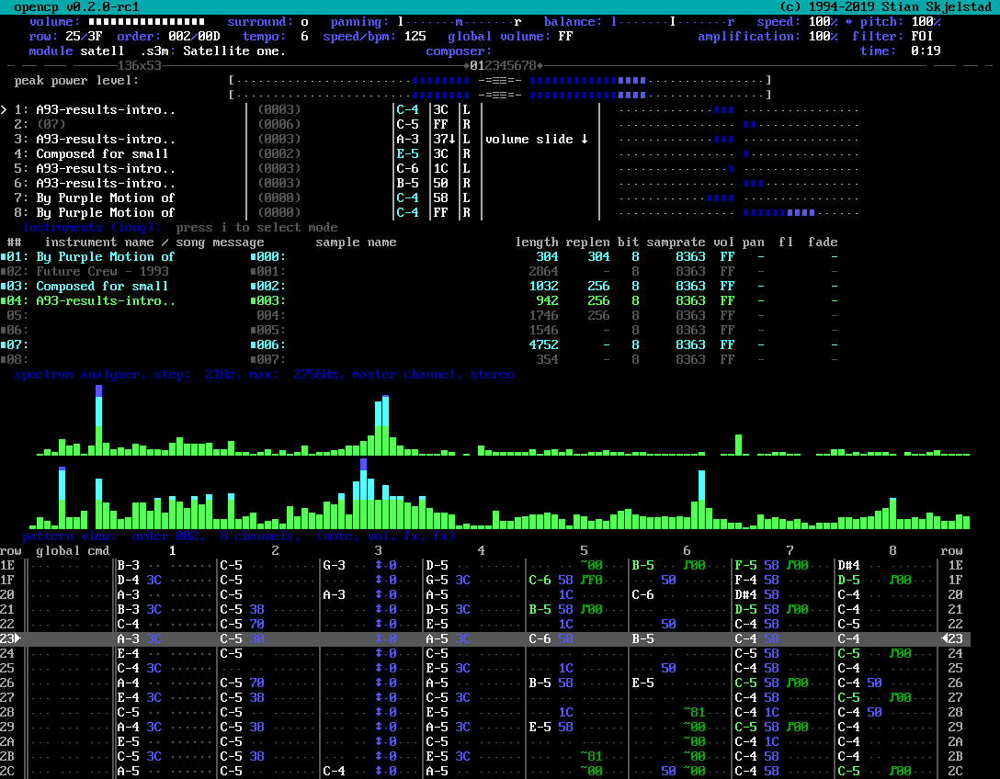

# Open Cubic Player

Unix port of [Open Cubic Player](https://www.cubic.org/player/), which is a text-based player with some few graphical views.
Visual output can be done through nCurses, Linux console (VCSA + FrameBuffer), X11 or SDL.
This port can be compiled for various different Unix-based operating systems, including MinGW compilers.



## Supported Formats

Amiga-style [module files](https://en.wikipedia.org/wiki/Module_file) and other module files (Amiga compressed files are decompressed using [ancient](https://github.com/temisu/ancient)): <!-- http://fileformats.archiveteam.org/wiki/Amiga_Module -->

Extension | Notes
:-------- | :----
`*.AMS`   | [Velvet Studio](http://www.pouet.net/prod.php?which=64890) and [Extreme's Tracker](https://www.pouet.net/prod.php?which=88711)
`*.DMF`   | [X-Tracker](http://www.pouet.net/prod.php?which=55233)
`*.IT`    | [Impulse Tracker](https://en.wikipedia.org/wiki/Impulse_Tracker) or the modern [Schism Tracker](http://schismtracker.org/)
`*.MDL`   | [DigiTrakker](http://www.pouet.net/prod.php?which=13371) or the modern [MilkyTracker](https://en.wikipedia.org/wiki/MilkyTracker)
`*.MOD`   | [ProTracker](https://en.wikipedia.org/wiki/ProTracker) or the modern [ProTracker Clone](https://github.com/8bitbubsy/pt2-clone)
`*.MTM`   | [MultiTracker Module Editor](http://www.pouet.net/prod.php?which=13362) <!-- - \*.MXM, mxmplayer - mini GUS player, intermediate file format to support .XM and similiar files -->
`*.NST`   | [NoiseTracker](https://en.wikipedia.org/wiki/NoiseTracker)
`*.OKT`   | [Oktalyzer](http://www.robotplanet.dk/amiga/oktalyzer/) <!-- https://www.wikidata.org/wiki/Q21041560 -->
`*.PTM`   | [PolyTracker](http://justsolve.archiveteam.org/wiki/Poly_Tracker_module)
`*.STM`   | [Scream Tracker 2](https://en.wikipedia.org/wiki/Scream_Tracker)
`*.S3M`   | [Scream Tracker 3](https://en.wikipedia.org/wiki/Scream_Tracker)
`*.ULT`   | [Ultra Tracker](http://www.pouet.net/prod.php?which=63386)
`*.WOW`   | Grave Composer <!-- http://fileformats.archiveteam.org/wiki/Grave_Composer_module -->
`*.XM`    | [FastTracker 2](https://en.wikipedia.org/wiki/FastTracker_2) or the modern [FastTracker 2 Clone](https://github.com/8bitbubsy/ft2-clone)
`*.669`   | [Composer 669](http://www.pouet.net/prod.php?which=63357) <!-- https://www.wikidata.org/wiki/Q9135198 -->

Supported files using code from [STYMulator](http://atariarea.krap.pl/stymulator/):

Extension | Notes
:-------- | :----
`*.YM`    | [Atari ST](https://en.wikipedia.org/wiki/Atari_ST#Technical_specifications) ([Yamaha YM2149](https://en.wikipedia.org/wiki/General_Instrument_AY-3-8910))

Supported files using fork of [libsidplayfp](https://sourceforge.net/p/sidplay-residfp/wiki/Home/):

Extension | Notes
:-------- | :----
`*.SID`, `*.RSID` | [C64](https://en.wikipedia.org/wiki/Commodore_64) ([SID 6581/8580](https://en.wikipedia.org/wiki/MOS_Technology_6581))

Supported files using code from [aylet](http://www.svgalib.org/rus/aylet.html):

Extension | Notes
:-------- | :----
`*.AY`    | [ZX Spectrum](https://en.wikipedia.org/wiki/ZX_Spectrum)/[Amstrad CPC](https://en.wikipedia.org/wiki/Amstrad_CPC) ([Yamaha YM2149](https://en.wikipedia.org/wiki/General_Instrument_AY-3-8910))

Supported audio files (both compressed and PCM styled):

Extension | Notes
:-------- | :----
`*.WAV`   |
`*.OGG`   |
`*.FLAC`  |
`*.MP2`   |
`*.MP3`   |
`*.QOA`   | [Quite OK Audio](https://qoaformat.org/)

Supported Audio-CD files:

Extension | Notes
:-------- | :----
`*.CDA`   | Linux support only, using digital read out API.
`*.CUE`   | [Cue sheet metadata](https://en.wikipedia.org/wiki/Cue_sheet_(computing))
`*.TOC`   | [CD recorder disc-at-once (cdrdao)](https://en.wikipedia.org/wiki/Cdrdao)

Supported files using fork of [TiMidity++](http://timidity.sourceforge.net/):

Extension | Notes
:-------- | :----
`*.MID`   | [General MIDI](https://en.wikipedia.org/wiki/MIDI#General_MIDI)

Supported files using [AdPlug](http://adplug.github.io/), for formats designed for the [OPL2](https://en.wikipedia.org/wiki/Yamaha_YM3812)/[OPL3](https://en.wikipedia.org/wiki/Yamaha_YMF262) AdLib sound chips:

Extension | Notes
:-------- | :----
`*.A2M`, `*.A2T` | [AdLib Tracker 2 by subz3ro](https://www.adlibtracker.net/)
`*.ADL`   | Coktel Vision Adlib Music
`*.AMD`   | Amusic tracker by Elyssis
`*.BAM`   | [Bob's Adlib Music](https://rpg.hamsterrepublic.com/ohrrpgce/BAM_Format)
`*.CMF`   | [Creative Music File Format by Creative Technology](https://www.vgmpf.com/Wiki/index.php?title=CMF)
`*.D00`   | EdLib
`*.HSC`   | HSC Adlib Composer by Hannes Seifert, [HSC-Tracker by Electronic Rats](https://demozoo.org/productions/293837/)
`*.IMF`, `*.WLF`, `*.ADLIB` | Apogee IMF, game music
`*.RAD`   | [Reality AdLib Tracker](https://www.3eality.com/productions/reality-adlib-tracker)
`*.SNG`   | SNGPlay by BUGSY of OBSESSION
`*.SNG`   | Adlib Tracker 1.0 by Dj-Tj
`*.VGM`   |
`*.XMS`   | XMS-Tracker by MaDoKaN/E.S.G

Supported files for [HivelyTracker](http://www.hivelytracker.co.uk/) tracked music, using code from the original tracker repository:

Extension | Notes
:-------- | :----
`*.HVL`   | [Hively Tracker](https://github.com/pete-gordon/hivelytracker)
`*.AHX`   | [AHX](http://amigascne.org/abyss/ahx/) or the not yet existing modern [AHX Clone](https://github.com/8bitbubsy/ahx-clone)

Supported files using the [Game Music Emulator](https://bitbucket.org/mpyne/game-music-emu/wiki/Home) (various retro game consoles):

Extension | Notes
:-------- | :----
`*.GBS`   | [GameBoy Sound System](https://en.wikipedia.org/wiki/Game_Boy_Sound_System)
`*.GYM`   | [Genesis YM2612](https://vgmrips.net/wiki/GYM_File_Format)
`*.HES`   | [Hudson Entertainment Sound](http://www.purose.net/befis/download/nezplug/hesspec.txt)
`*.KSS`   | [Konami Sound System?](http://www.vgmpf.com/Wiki/index.php?title=KSS)
`*.NSF`, `*.NSFe` | [Nintendo Sound Format](https://www.nesdev.org/wiki/NSF)
`*.SAP`   | [Slight Atari Player](https://asap.sourceforge.net/sap-format.html)
`*.SPC`   | [Super Nintendo / Super Famicom SPC-700 co-processor](http://vspcplay.raphnet.net/spc_file_format.txt)
`*.VGM`, `*.VGZ` | [Video Game Music](https://vgmrips.net/wiki/VGM_File_Format)

## Integrated support for modland.com

Built into the file-browser is support for directly browsing <https://modland.com> utilizing `curl`.

You need to initially fetch the database containing all the file names. This is available via `modland.com/setup.dev` inside the built-in file browser.

## Manual Page

Available in [Debian manpages](https://manpages.debian.org/testing/opencubicplayer/ocp.1.en.html).

## Usage

> [!NOTE]
> If key letters are CAPITAL, press them with <kbd>shift</kbd>.

Keys | Description
:--- | :----------
<kbd>esc</kbd><kbd>esc</kbd> | Exit the program.
<kbd>alt</kbd> + <kbd>k</kbd> | List available key shortcuts in the current view.

### While playing

Keys | Description
:--- | :----------
<kbd>Enter</kbd> | Next file from the playlist, if playlist is empty it opens the file-browser.
<kbd>f</kbd> | File-browser.
<kbd><</kbd> | Rewind.
<kbd>></kbd> | Fast Forward.
<kbd>a</kbd> | Text FFT analyzer, <kbd>A</kbd>: toggle FFT analyzer, <kbd>tab</kbd>: toggle colors.
<kbd>b</kbd> | Phase viewer.
<kbd>c</kbd> | Text Channel viewer.
<kbd>d</kbd> | Start a shell (only works if using the console/curses version).
<kbd>s</kbd> | Un/Silence channel.
<kbd>q</kbd> | Un/Quiet other channels (solo/unsolo).
<kbd>t</kbd> | Text Track viewer.
<kbd>g</kbd> | Lo-Res FFT analyzer + history, <kbd>G</kbd>: high-Res FFT analyzer + history.
<kbd>o</kbd> | Oscilloscope.
<kbd>v</kbd> | Peak power level.
<kbd>w</kbd> | Würfel mode (requires animation files to be present).
<kbd>m</kbd> | Volume control.
<kbd>n</kbd> | Note dots.
<kbd>x</kbd> / <kbd>alt</kbd> + <kbd>x</kbd> | Extended mode / normal mode toggle.
<kbd>'</kbd> | Link view.
<kbd>,</kbd> / <kbd>.</kbd> | Fine panning.
<kbd>+</kbd> / <kbd>-</kbd> | Fine volume.
<kbd>*</kbd> / <kbd>/</kbd> | Fine balance.
<kbd>Backspace</kbd> | Toggle filter.
<kbd>f1</kbd> / <kbd>?</kbd> / <kbd>h</kbd> | Online Help.
<kbd>f2</kbd> | Lower Volume.
<kbd>f3</kbd> | Increase Volume.
<kbd>f4</kbd> | Toggle Surround.
<kbd>f5</kbd> | Panning left.
<kbd>f6</kbd> | Panning right.
<kbd>f7</kbd> | Balance left.
<kbd>f8</kbd> | Balance right.
<kbd>f9</kbd> | Decrease playback speed.
<kbd>f10</kbd> | Increase playback speed.
<kbd>\\</kbd> | Toggle pitch/speed lock (if file format makes this possible).
<kbd>f11</kbd> | Decrease playback pitch.
<kbd>f12</kbd> | Increase playback pitch.

### File browser

Keys | Description
:--- | :----------
<kbd>alt</kbd> + <kbd>e</kbd> | Edit meta-information.
<kbd>alt</kbd> + <kbd>i</kbd> | Toggle file-list columns (long filename, title, etc).
<kbd>alt</kbd> + <kbd>c</kbd> | Open system options list.
<kbd>Insert</kbd> | Add to playlist.
<kbd>Delete</kbd> | Remove from playlist.
<kbd>Tab</kbd> | Move cursor between filelist and playlist.

## Installing binaries on Linux

See: <https://repology.org/project/ocp-open-cubic-player/versions>

## GNU Unifont

[GNU Unifont files](https://unifoundry.com/unifont/) are required when X11/SDL support is enabled.
This is an 8x16 font that has the main goal of being UTF-8/Unicode complete.
For special scripts it will look incorrect, but the character-set should be complete.

In most systems, Unifont files will be installed in `/usr/share/fonts/truetype/unifont/` or `/usr/share/fonts/opentype/unifont/`.
If this path is different for your system, you can configure the correct path using `--with-unifontdir-ttf=/your/path` and/or `--with-unifontdir-otf=/your/path` when invoking `./configure`.

If the Unifont files on your system are not named exactly `unifont.ttf`, `unifont_csur.ttf` and `unifont_upper.ttf`, the filenames can be configured using `--with-unifont-ttf=/your/path/UniFont.ttf`, `--with-unifont-csur-ttf=/your/path/UniFont-CSUR.ttf` and/or `--with-unifont-upper-ttf=/your/path/UniFont-Upper.ttf`.
For the OpenType version of the files, use `--with-unifont-otf`, `--with-unifont-csur-otf` and/or `--with-unifont-upper-otf`.

If the filenames on your system contains version numbers, we ask you to fill a bug-report to your system provider and ask them to add symlinks without version numbers in them.

## Installing on macOS

Use: `brew install ocp`

### Additional notes for Darwin

If you use liboss, you might need to edit `/opt/local/lib/pkgconfig/liboss.pc` and remove `-Wno-precomp` (liboss 0.0.1 is known to be broken and crashes, so we discourage the use of liboss).

To configure Darwin, my experience is that you need to run configure like this:
```
PATH=$PATH:/opt/local/bin LDFLAGS=-L/opt/local/lib CFLAGS=-I/opt/local/include CXXFLAGS=-I/opt/local/include CPPFLAGS=-I/opt/local/include CPPCXXFLAGS=-I/opt/local/include ./configure
```

and optionally add things like `--prefix` etc.

To get curses up and running with colors, you need to run ocp like this:
```
TERM=xterm-color ocp-curses
```

## Docker Images

Files for building Docker images for Open Cubic Player are available in [this repository](https://github.com/hhromic/opencubicplayer-docker).

Ready to use images can be pulled directly from the GitHub Container Registry of the repository.

Refer to the [README file](https://github.com/hhromic/opencubicplayer-docker?tab=readme-ov-file#readme) for usage information and more details.

## Sample sources of where to find music

* <https://modarchive.org/>
* <http://www.chiptune.com/>
* <http://www.keygenmusic.net/>
* <https://hornet.org/music/>
* <https://modland.com/pub/modules/>

## IRC

Available at <https://libera.chat> in `#ocp`.

## Packaging Status

[](https://repology.org/project/ocp-open-cubic-player/versions)
